# Performance Comparison `v10.3.0` vs `v10.4.0-rc1`

## Comments

- Bounded tests show no significant differences on the considered metrics.
- Unbounded tests are more interesting, though:
  - For the first time in the history of the performance comparisons (at least since I've been running them), the number of supported users in Postgres is lower than in MySQL: a 7.9% decrease in the base build (v10.3.0) and a 2.7% decrease in the new build (v10.4.0-rc1).
  - The number of supported users in v10.3.0 is also lower when compared to the latest performance comparison, where we tested v10.3.0-rc1: a 10.2% decrease in MySQL and a staggering 19.7% decrease in Postgres. We always see some variance from comparison to comparison, which can be attributed to the randomness of the tests, to the changes in the load-test tool, and to the slight variance in the instance allocated resources. However, a 20% decrease is a great difference, and that seems to explain why Postgres has a number of supported users lower than MySQL's.
  - The beginning of both MySQL and Postgres tests is more bumpy in the new build. That is, when comparing the first 15 or 20 minutes of both builds, we see that v10.3.0 starts steadily increasing the number of connected users more rapidly than v10.4.0-rc1. This translates in a shift of the ramp-up curve, with Postgres having \~1.6k users more in v10.3.0 than in v10.4.0-rc1 until the wavy pattern starts, and with MySQL having \~900 users more in v10.3.0 than in v10.4.0-rc1 until the wavy pattern starts.
  - However, the final delta in the number of supported users is positive in both MySQL and Postgres, increasing for the new release a +0.41% for MySQL, which is not significant enough, but a more important +6.07% for Postgres, which goes above the \[-5%, +5%\] variance we're used to see.
  - Reviewing [the differences](https://github.com/mattermost/mattermost-load-test-ng/releases/tag/v1.24.0) between the versions of the load-test tool used in the latest performance comparison (v1.23) and in this one (v1.24), the only significant one seems to be [the fix of the vacuum step](https://github.com/mattermost/mattermost-load-test-ng/pull/853), that it is now run in comparisons as well. This happens only in Postgres. In theory, this change should improve the performance of the database. In the past, we have seen that with a very performant database, we sometimes get poorer results due to an increase of the requests, as the agents have more time to run more actions. We still don't know if this is the case here.
- A minor note: the agents log the line `Invalid or missing submitPerformanceReport in request body` one time per connected user per minute.

## Action Items

- Given the positive delta in the number of supported users in v10.4.0-RC1, in my opinion we can unblock the release. ~~However, I would like to discuss this with the team.~~ After [a short discussion in the thread](Mattermost), we agreed to unblock the release.
- We should take a further look at the general decrease of supported users in Postgres across both releases, and at the bumpiness at the beginning of both MySQL and Postgres: [MM-62366](https://mattermost.atlassian.net/browse/MM-62366) I have a suspicion that this is due to the vacuum step change, but we need to verify it. For that we should:
  - Run this same performance comparison, but using the load-test tool version v1.23.0 instead of v1.24.0. We can run this only for Postgres unbounded.
  - If that new test does not show the issues seen in this performance comparison, we should repeat it with v1.24.0, but with [PR \#853](https://github.com/mattermost/mattermost-load-test-ng/pull/853) reverted to isolate the error.
  - When the issue is reproduced, take a look at RDS metrics and AWS performance insights.
- As a follow-up task, we need to investigate the performance report errors: [MM-62365](https://mattermost.atlassian.net/browse/MM-62365).

## Setup

| Setting                              | Value                                                                                   |
| ------------------------------------ | --------------------------------------------------------------------------------------- |
| Load-test version                    | [`v1.24.0`](https://github.com/mattermost/mattermost-load-test-ng/releases/tag/v1.24.0) |
| Dataset                              | DB dump from `v6.1.0` with 12M posts                                                    |
| Bounded - number of users (Postgres) | 7500                                                                                    |
| Bounded - number of users (MySQL)    | 5000                                                                                    |
| Bounded - duration                   | 90 minutes                                                                              |
| Unbounded - MaxActiveUsers           | 20000                                                                                   |
| Unbounded - num of users per agent   | 2000                                                                                    |
| App instances                        | 2 x c7i.2xlarge                                                                         |
| Agent instances                      | 11 x c7i.xlarge                                                                         |
| Proxy Instance                       | 1 x c7i.xlarge                                                                          |
| DB instances                         | 2 x db.r7g.2xlarge                                                                      |

## Results

### Grafana

These are snapshots of the original Grafana dashboards.

- [Bounded - MySQL](https://snapshots.raintank.io/dashboard/snapshot/uOEKmzmxWVvoC2j7JAk0itc9EKKKm6EC)
- [Bounded - Postgres](https://snapshots.raintank.io/dashboard/snapshot/BgTEyE70CHV69zcnPfiWQOt7sV92Ays8)
- [Unbounded - MySQL](https://snapshots.raintank.io/dashboard/snapshot/1BPBpb5nEx1MiKziNEKbAFnlt6eIC3Im)
- [Unbounded - Postgres](https://snapshots.raintank.io/dashboard/snapshot/9bI2DG6Ql5kjDhIUxfZC3KmDFnwvhPAD)

### Supported users in unbounded tests

| Test     | v10.3.0 | v10.4.0-rc1 | Delta |
| -------- | ------- | ----------- | ----- |
| MySQL    | 7097    | 7126        | 0.41% |
| Postgres | 6537    | 6934        | 6.07% |

### Graphs - Bounded MySQL

| 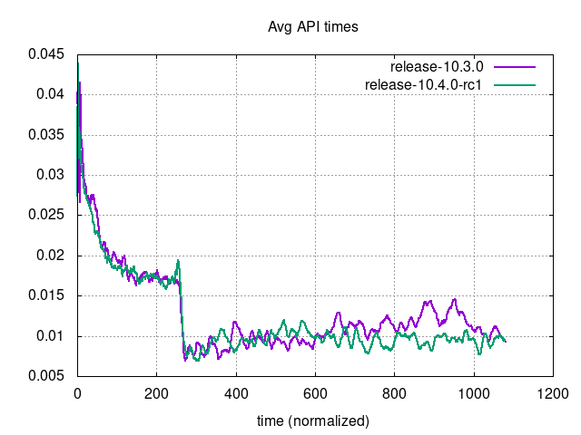 |  |
| --- | ---|
| 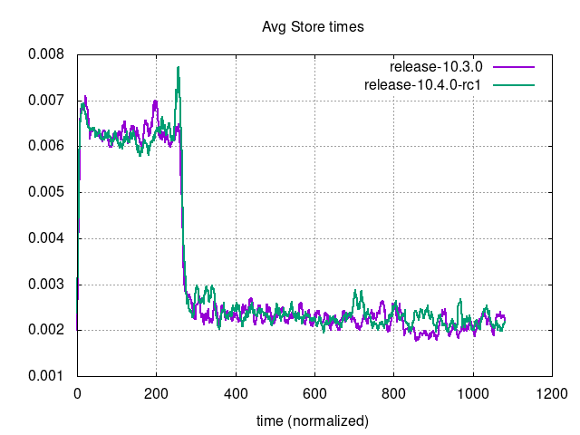 | 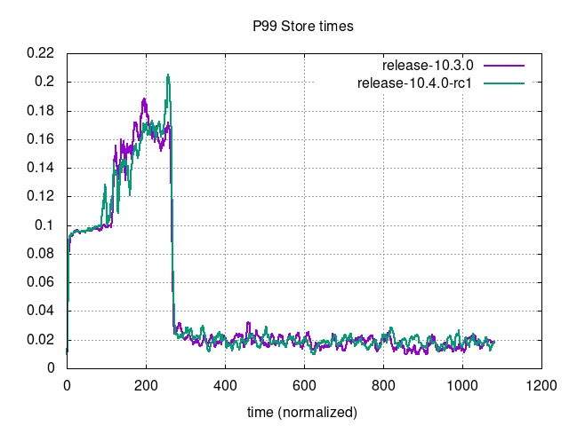 |
| 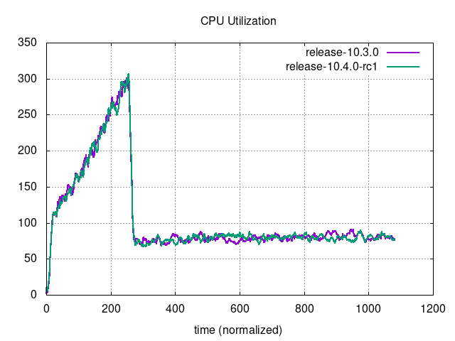 | 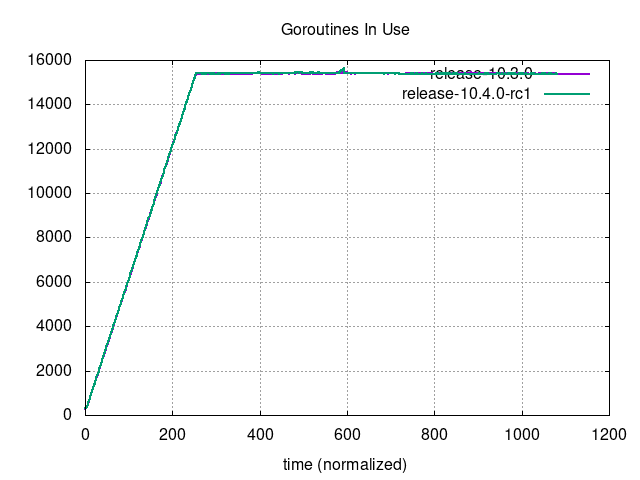 |
| 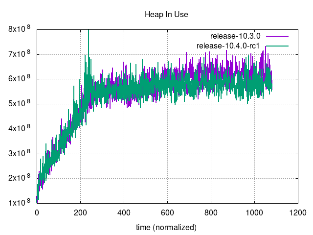 | 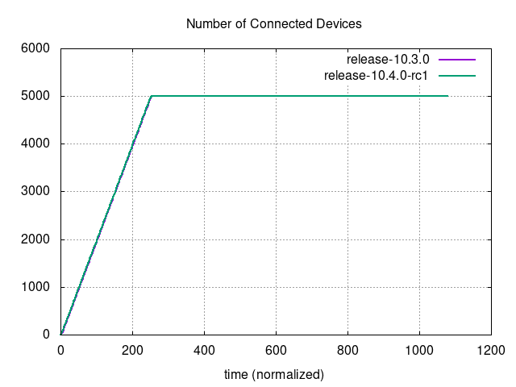 |
|  | 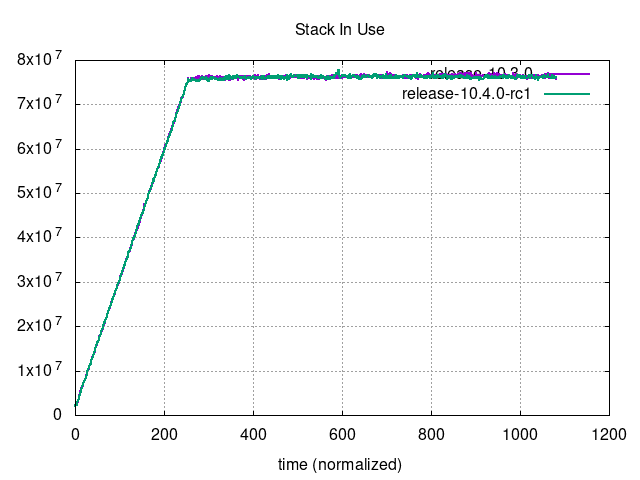 |

### Graphs - Bounded Postgres

| 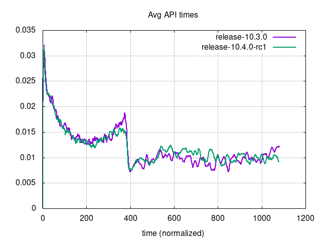 | 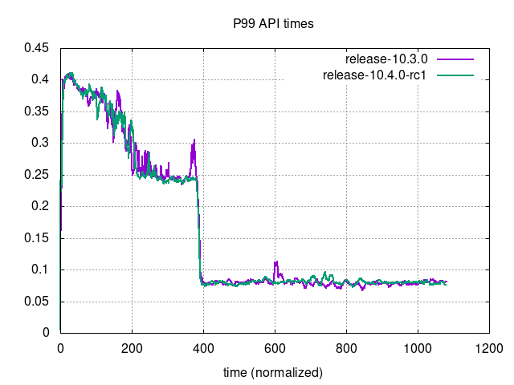 |
| --- | ---|
|  |  |
| 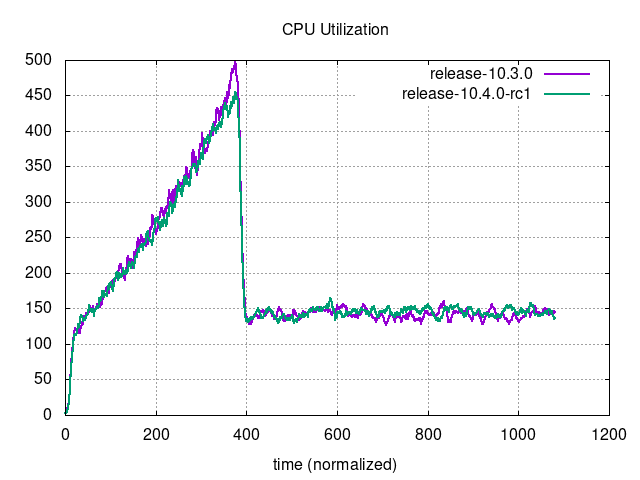 | 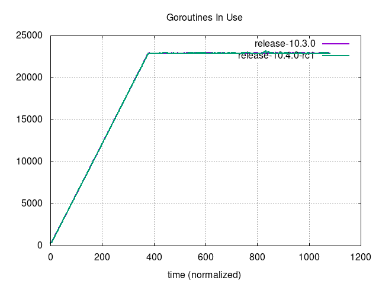 |
|  | 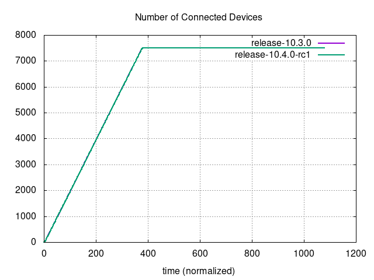 |
| 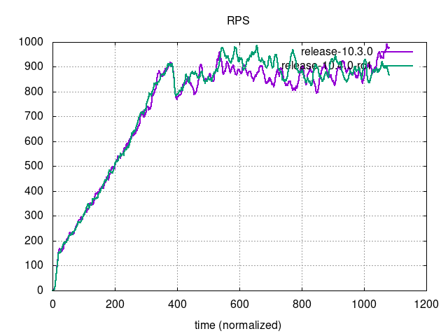 |  |

### Graphs - Unbounded MySQL

| 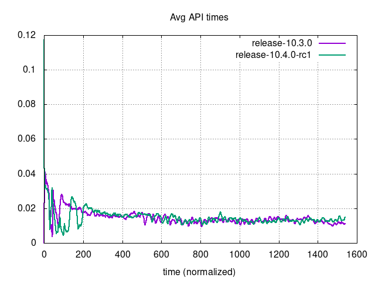     | 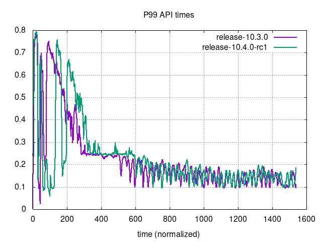                             |
| --- | --- |
| 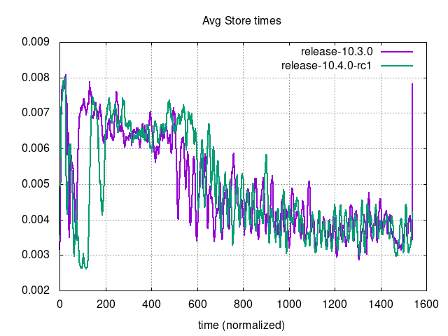 | 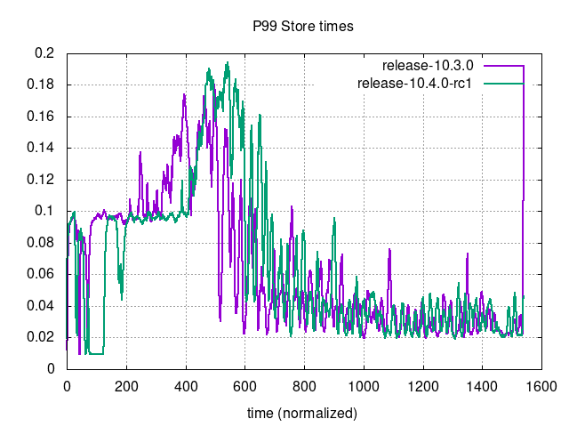                         |
|  |                      |
| 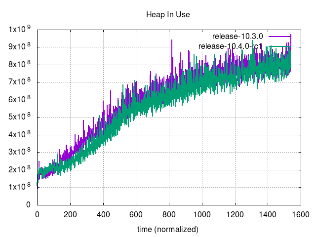         | 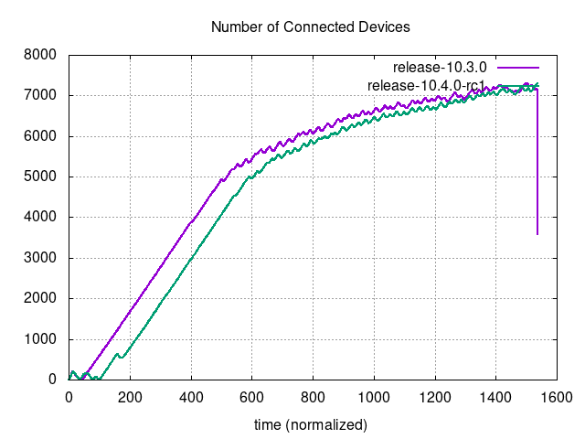 |
| 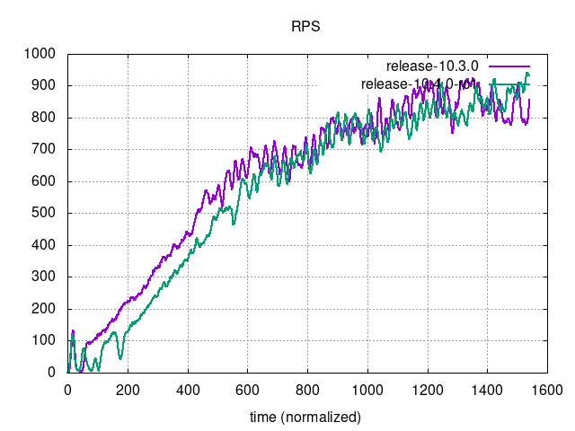                         | 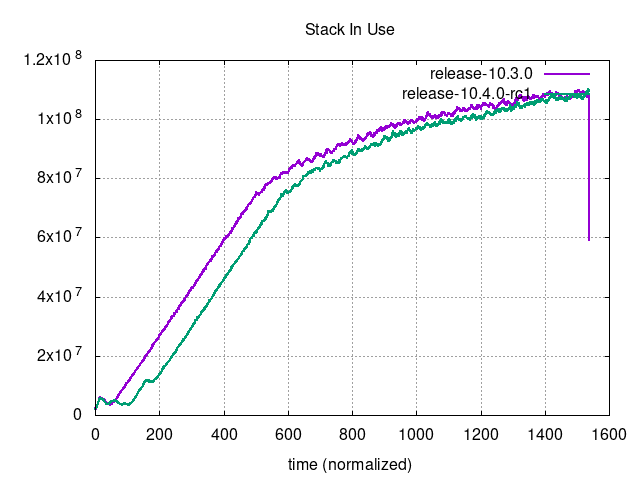                               |

### Graphs - Unbounded Postgres

|      | 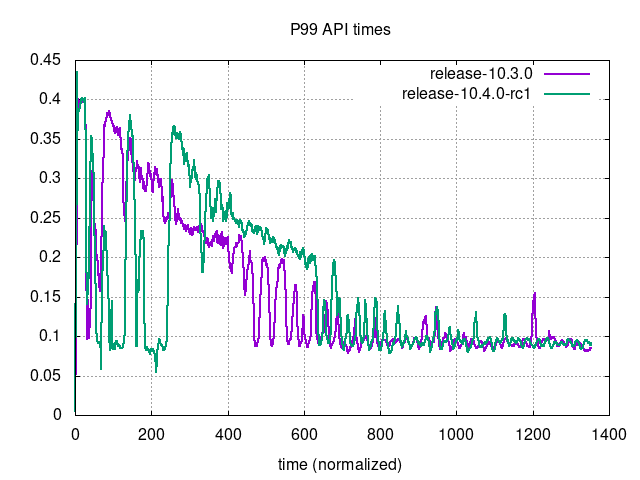                             |
| --- | ---|
|  | 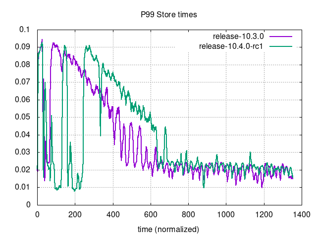                         |
|  | 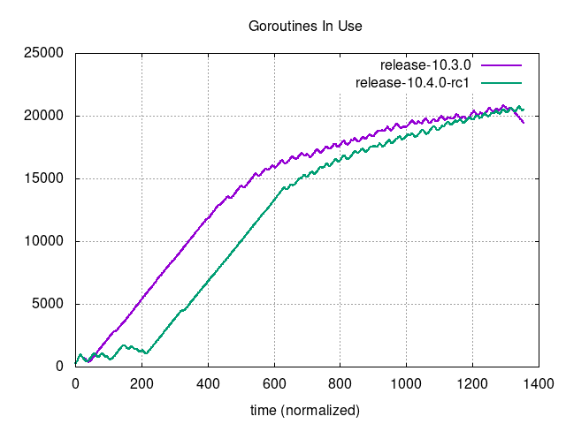                     |
| 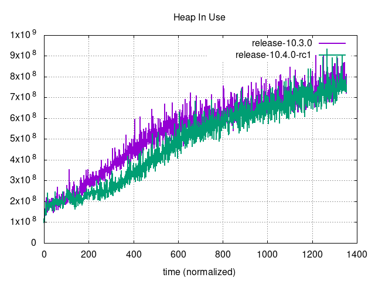         |  |
| 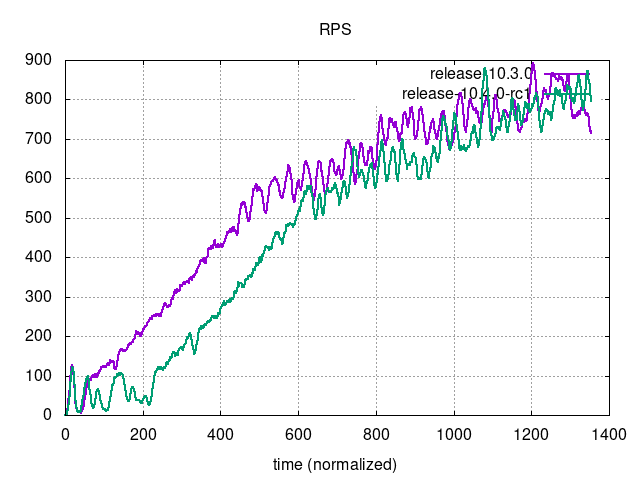                         | 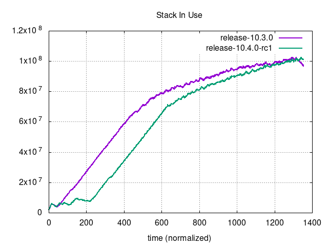                               |
